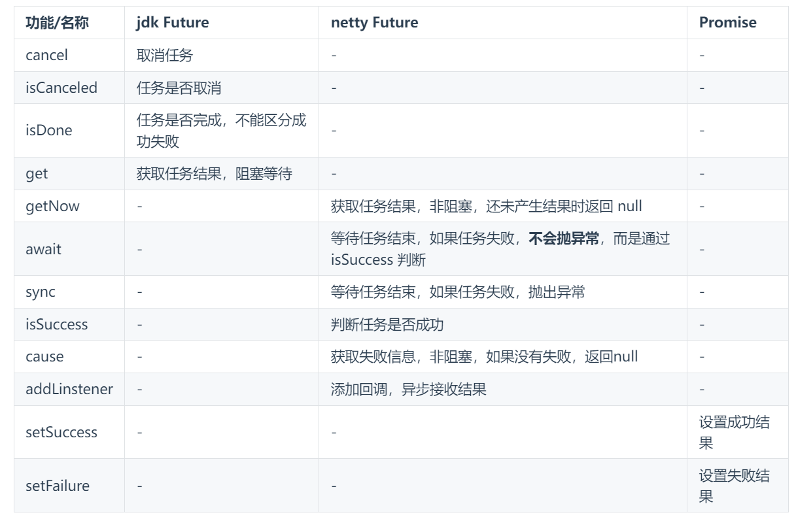

## 概念
1. netty 中的 Future 与 jdk 中的 Future 同名，但是是两个接口
2. netty 的 Future 继承自 jdk 的 Future，而 Promise 又对 netty Future 进行了扩展
3. jdk Future 只能同步等待任务结束（或成功、或失败）才能得到结果
4. netty Future 可以同步等待任务结束得到结果，也可以异步方式得到结果，但都是要等任务结束
5. netty Promise 不仅有 netty Future 的功能，而且脱离了任务独立存在，只作为两个线程间传递结果的容器

## 比较
